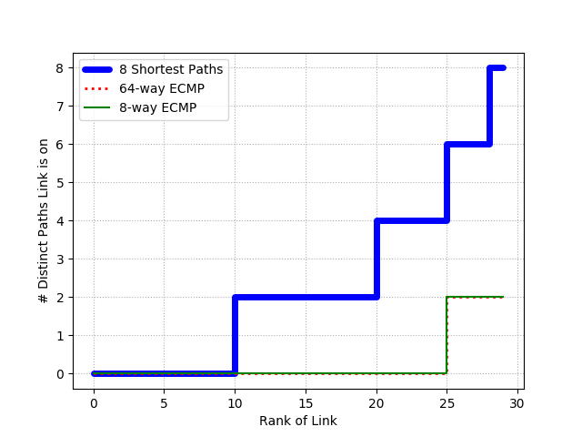

# Experimento: JellyFish vs Fat Tree
### Desenvolvido por: José Flauzino

Neste repositório você encontra meus códigos para executar os experimentos que reproduzem a Figura 9 e Tabela 1 do artigo "Jellyfish: Networking Data Centers Randomly".
Saiba mais sobre os objetivos e motivações na <a href="https://github.com/joseflauzino/JellyFish_vs_FatTree/wiki">Wiki do Projeto</a> 

## Obtendo os códigos
1. Verifique se em seu sistema o prgrama git já está instalado com o comando `git`. Caso apareça as informações de ajuda do git é sinal que ele está instalado, caso contrário use o comando a seguir para fazer a instalação: `sudo apt-get update && apt-get install git`.

2. Crie ou escolha um diretório do seu sistema para armazenar os arquivos e entre neste diretório.

3. Faça o clone do repositório no diretório escolhido com o comando `git clone https://github.com/joseflauzino/JellyFish_vs_FatTree`.

## Instalação de pacotes necessários
1. Execute `bash setup.sh` para instalar o Ripl e Riplpox

## Para reproduzir a Figura 9

1. Execute `python main.py [N_SWICTHES] [N_LINKS] [N_HOSTS]`, onde [N_SWITCHES] deve ser substituido pelo número de swicthes a rede deve ter, [N_LINKS] é a quantidade de links que cada swicth deve conter e, por fim, [N_HOSTS] é a quantidade de hosts da rede.
2. Exemplo de comando: `python main.py 10 3 4`. Neste caso a rede criada terá 10 switches com 3 conexões cada e 4 hosts na rede.
3. Ao término do processamento a figura estará no diretório /graphics com o nome de acordo com os parâmetros usados no comando. Por exemplo, se o comando foi idêntico ao exemplo do passo 2 o nome da figura será 10sw_3links_4hosts.png. 

</img>

### Possíveis erros
Para ver as soluções de principais erros que podem ocorrer acesse a página de <a href="https://github.com/joseflauzino/JellyFish_vs_FatTree/wiki/Solu%C3%A7ao-de-Poss%C3%ADveis-Erros">Solução de Possíveis Erros</a> na wiki do projeto.

## Para reproduzir a Tabela 1
Desenvolvimento em andamento.
