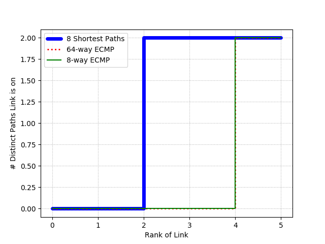

# Experimento: JellyFish vs Fat Tree
## Por: José Flauzino

Neste repositório você encontra meus códigos para executar os experimentos que reproduzem a Figura 9 e Tabela 1 do artigo "Jellyfish: Networking Data Centers Randomly".
Saiba mais sobre os objetivos e motivações na <a href="https://github.com/joseflauzino/JellyFish_vs_FatTree/wiki">wiki</a> 

## Instalação de pacotes necessários
1. Execute `bash setup.sh` para instalar o Ripl e Riplpox

## Para reproduzir a Figura 9

1. Execute `python main.py [N_SWICTHES] [N_LINKS] [N_SERVERS]`, onde [N_SWITCHES] deve ser substituido pelo número de swicthes a rede deve ter, [N_LINKS] é a quantidade de links que cada swicth deve conter e, por fim, [N_SERVERS] é a quantidade de servidores da rede.
2. Exemplo de comando: `python main.py 10 3 4`. Neste caso a rede criada terá 10 switches com 3 conexões cada e 4 servidores na rede.
3. Ao término do processamento a figura estará no diretório /graphics com o nome de acordo com os parâmetros usados no comando. Por exemplo, se o comando foi idêntico ao exemplo do passo 2 o nome da figura será plot_10sw_3ports_4servers. 

### Possíveis erros

### Observações:

## Para reproduzir a Tabela 1
