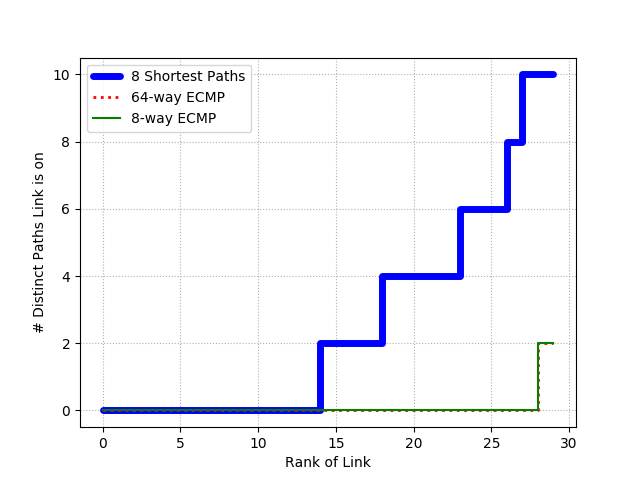

# Experimento: JellyFish
### Desenvolvido por: José Flauzino

Neste repositório você encontra os códigos para executar os experimentos que reproduzem a Figura 9 e Tabela 1 do artigo "Jellyfish: Networking Data Centers Randomly".

Saiba mais sobre o desenvolvimento na <a href="https://github.com/joseflauzino/JellyFish_vs_FatTree/wiki">Wiki do Projeto</a> 

## Pré requisitos
Os seguintes programas devem estar instalados em seu sistema.
* Git - para obter os códigos.
* Mininet - para simular a rede.

## Obtendo os códigos
1. Crie ou escolha um diretório do seu sistema para armazenar os arquivos e entre neste diretório.

2. Faça o clone do repositório no diretório escolhido com o comando `git clone https://github.com/joseflauzino/JellyFish_vs_FatTree`.

## Instalação de pacotes necessários
1. Execute `sudo bash install.sh` para instalar o Ripl e Riplpox

## Para reproduzir a Figura 9

1. Execute `python main_jelly.py [N_SWICTHES] [N_LINKS] [N_HOSTS]`, onde [N_SWITCHES] deve ser substituido pelo número de swicthes a rede deve ter, [N_LINKS] é a quantidade de links que cada swicth deve conter e, por fim, [N_HOSTS] é a quantidade de hosts da rede.

	Exemplo de comando: `python main_jelly.py 10 3 4`. Neste caso a rede criada terá 10 switches com 3 conexões cada e 4 hosts na rede.
2. Ao término do processamento a figura estará no diretório figures/ com o nome de acordo com os parâmetros usados no comando. Por exemplo, se o comando foi idêntico ao exemplo do passo 1 o nome da figura será 3links_10sw.png.

A figura a seguir representa o resultado obtido com os parâmetros dos exemplos acima. 

</img>

> Para ver as soluções de principais erros que podem ocorrer acesse a página de <a href="https://github.com/joseflauzino/JellyFish_vs_FatTree/wiki/Solu%C3%A7ao-de-Poss%C3%ADveis-Erros">Solução de Possíveis Erros</a> na Wiki do projeto.

## Para reproduzir a Tabela 1

Essa tabela é composta por dados obtidos através de vários testes. Assim, visando maior clareza, os testes foram separados em duas partes: com a topologia Jellyfish e com a Fat-Tree. Isso porque os passos são diferentes, já que os próximos testes da Jellyfish utilizam dados criados durante o experimento da Figura 9.

### Testes com a Jellyfish:

1. Execute o seguinte comando: `pox/pox.py riplpox.riplpox --topo=jelly,[N_SWITCHES],[N_PORTS],[ADJ_LIST_FILE] --routing=[TOPOLOGY],[ROUTING_FILE] --mode=reactive`

	Exemplo de comando para 10 switches com 3 portas cada, lista de adjacencia chamada 'adjList_3links_10sw' e arquivo de rotas chamado 'ecmp_3links_10sw.pkl'
	`pox/pox.py riplpox.riplpox --topo=jelly,10,3,adjList_3links_10sw --routing=jelly,ecmp_3links_10sw --mode=reactive`

2. Abra outro terminal, entre novamente no diretório git e execute `python generate_cmds_jelly.py [N_SWITCHES] [N_PORTS] [N_FLOWS] [ADJ_LIST_FILE] [ROUTING_FILE] > [MN_SCRIPT_FILE]`

	Exemplo `python generate_cmds_jelly.py 10 3 8 adjList_3links_10sw ecmp_3links_10sw > jelly_mn_script_ecmp_8flows`

	> Nota: [N_FLOWS] representa a quantidade de fluxos TCP que será utilizado nos testes, no exemplo são 8 fluxos.

	> Nota: [MN_SCRIPT_FILE] é o nome do arquivo de script Mininet que será criado ao executar o comando, portanto o arquivo não precisa existir (ele será criado).

3. Inicie o Mininet com o comando `sudo mn --custom ripl/ripl/mn.py --topo jelly,[N_SWITCHES],[N_PORTS],[ADJ_LIST_FILE] --link tc --controller=remote --mac`

	Exemplo `sudo mn --custom ripl/ripl/mn.py --topo jelly,10,3,adjList_3links_10sw --link tc --controller=remote --mac`

4. Na CLI do Mininet execute `source [MN_SCRIPT_FILE]`.

	Exemplo `source jelly_mn_script_ecmp_8flows`

5. O resultado estará no diretório outputs/jelly.

### Testes com a Fat-Tree:

1. Execute `python pox/pox.py DCController --topo=ft,[N_PODS] --routing='[ROUTE_PROTO]'`

	Exemplo `python pox/pox.py DCController --topo=ft,4 --routing=ECMP`

2. Abra outro terminal e execute `python generate_cmds_fat.py [N_PODS] [N_FLOWS] [ROUTE_PROTO] > [MN_SCRIPT_FILE]`

	Exemplo `python generate_cmds_fat.py 4 8 ecmp > fat_mn_script_ecmp_8flows`

3. Inicie o Mininet com o comando `mn --custom ripl/ripl/mn.py --topo ft,[N_PODS] --controller=remote --mac --link tc,bw=10,delay=10ms`

	Exemplo `mn --custom ripl/ripl/mn.py --topo ft,4 --controller=remote --mac --link tc,bw=10,delay=10ms`

4. Na CLI do Mininet execute `source [MN_SCRIPT_FILE]`

	Exemplo `source fat_mn_script_ecmp_8flows`

5. O resultado estará no diretório outputs/fat.